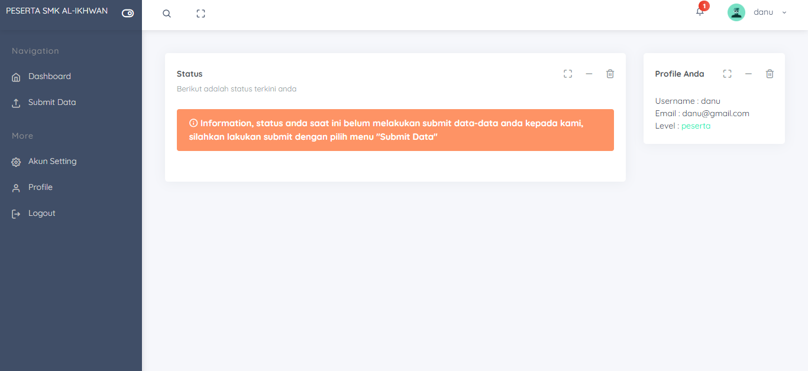
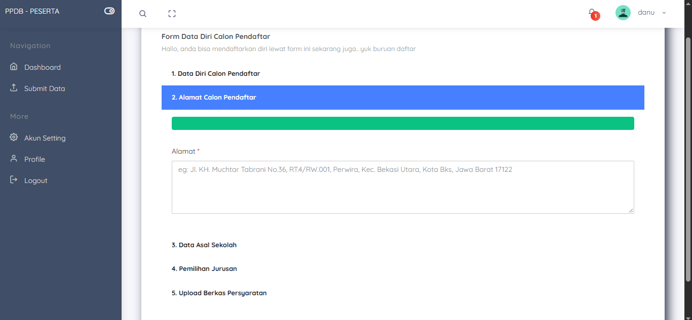
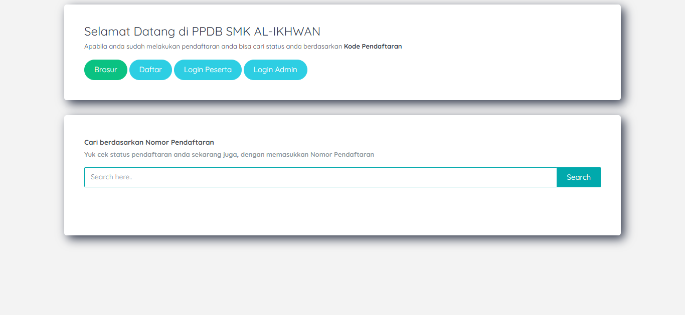

# 🎓 E-PPDB SMK Al-Ikhwan

**E-PPDB SMK Al-Ikhwan** adalah sistem informasi **Penerimaan Peserta Didik Baru (PPDB) berbasis web** yang saya buat sebagai tugas **Proyek Perangkat Lunak (PPL)**.

Project ini dibuat berdasarkan kondisi PPDB di SMK Al-Ikhwan yang pada saat project dikembangkan masih banyak dilakukan secara manual. Sistem ini dirancang untuk membantu proses pendaftaran calon siswa, pengumpulan berkas, pemeriksaan data oleh admin, hingga penyampaian informasi hasil seleksi.

---

## 📌 Latar Belakang

Proses PPDB yang masih dilakukan secara manual dapat menyebabkan beberapa kendala, seperti:

- Calon siswa harus mengisi dan menyerahkan data secara langsung.
- Pengumpulan dokumen membutuhkan proses administrasi yang lebih banyak.
- Admin harus memeriksa data dan berkas secara manual.
- Informasi status pendaftaran tidak selalu dapat diketahui calon siswa dengan cepat.
- Pengelolaan data pendaftar menjadi lebih sulit ketika jumlah calon siswa bertambah.

Berdasarkan permasalahan tersebut, dibuatlah **E-PPDB SMK Al-Ikhwan** sebagai solusi digital untuk membantu mengelola proses penerimaan siswa baru secara lebih terstruktur.

---

## 🎯 Tujuan Project

Project ini bertujuan untuk:

- Mendigitalisasi proses pendaftaran calon siswa.
- Memudahkan calon siswa dalam melakukan pendaftaran.
- Mengurangi proses administrasi yang masih dilakukan secara manual.
- Membantu admin mengelola data calon siswa.
- Mempermudah pemeriksaan dan pengelolaan berkas persyaratan.
- Memberikan informasi status pendaftaran kepada calon siswa.
- Menyediakan sistem pengumuman hasil penerimaan calon siswa.

---

## 🖥️ Hasil Project

Hasil akhir project berupa **sistem PPDB berbasis web** yang memiliki dua sisi utama:

### 👨‍🎓 Sisi Calon Siswa

Calon siswa dapat:

- Melihat informasi PPDB.
- Melakukan pendaftaran.
- Mengisi data diri.
- Mengisi alamat.
- Mengisi data asal sekolah.
- Memilih jurusan.
- Mengunggah berkas persyaratan.
- Melihat status pendaftaran.
- Melihat informasi hasil penerimaan.

### 👨‍💼 Sisi Admin

Admin memiliki fungsi untuk mengelola proses PPDB, antara lain:

- Melihat data seluruh calon siswa.
- Melihat detail data pendaftar.
- Memeriksa data yang telah dikirim.
- Memeriksa berkas persyaratan yang diunggah.
- Memvalidasi data dan berkas calon siswa.
- Mengelola data pendaftar.
- Mengelola proses/status penerimaan.
- Menampilkan informasi pengumuman hasil penerimaan.

---

## 📸 Tampilan Aplikasi

### 1. Dashboard Calon Siswa

Berikut merupakan contoh tampilan dashboard calon siswa setelah melakukan login.



Pada dashboard terdapat informasi status pendaftaran. Sistem dapat memberikan pemberitahuan apabila calon siswa belum melakukan submit data.

Dashboard juga menyediakan navigasi seperti:

- Dashboard
- Submit Data
- Akun Setting
- Profile
- Logout

---

### 2. Form Data Calon Pendaftar

Calon siswa dapat mengisi data melalui form pendaftaran yang dibuat secara bertahap.



Form pendaftaran mencakup beberapa tahapan, yaitu:

1. Data diri calon pendaftar.
2. Alamat calon pendaftar.
3. Data asal sekolah.
4. Pemilihan jurusan.
5. Upload berkas persyaratan.

Pendekatan bertahap ini digunakan agar proses pengisian data lebih terstruktur dan tidak terlalu membebani pengguna dalam satu halaman.

---

### 3. Beranda PPDB

Beranda menjadi halaman awal bagi calon siswa yang ingin mendapatkan informasi mengenai PPDB SMK Al-Ikhwan.



Pada halaman ini terdapat beberapa akses utama:

- **Brosur** — melihat informasi/brosur PPDB.
- **Daftar** — menuju proses pendaftaran.
- **Login Peserta** — masuk ke akun calon siswa.
- **Login Admin** — masuk ke halaman pengelolaan admin.

Selain itu tersedia fitur pencarian status pendaftaran berdasarkan **Nomor Pendaftaran**.

---

## 🔄 Alur Sistem

Secara umum, alur sistem PPDB adalah:

```text
Calon Siswa
     ↓
Melihat Informasi PPDB
     ↓
Melakukan Pendaftaran
     ↓
Mengisi Data Diri
     ↓
Mengisi Alamat
     ↓
Mengisi Data Asal Sekolah
     ↓
Memilih Jurusan
     ↓
Upload Berkas Persyaratan
     ↓
Submit Data
     ↓
Admin Memeriksa Data & Berkas
     ↓
Validasi / Pengelolaan Status
     ↓
Pengumuman Hasil Penerimaan
     ↓
Calon Siswa Melihat Status
```

---

## 📋 Modul Calon Siswa

### 1. Informasi PPDB

Calon siswa dapat melihat informasi dasar mengenai penerimaan peserta didik baru sebelum melakukan pendaftaran.

### 2. Pendaftaran

Calon siswa dapat membuat data pendaftaran untuk mendapatkan akses ke sistem.

### 3. Data Diri

Sistem menyediakan form untuk mengisi informasi pribadi calon siswa.

### 4. Alamat

Calon siswa dapat memasukkan alamat tempat tinggal sesuai data yang diperlukan sekolah.

### 5. Data Asal Sekolah

Data mengenai sekolah asal calon siswa dapat dimasukkan melalui sistem.

### 6. Pemilihan Jurusan

Calon siswa dapat memilih jurusan yang tersedia dalam proses pendaftaran.

### 7. Upload Berkas

Calon siswa dapat mengunggah dokumen persyaratan yang dibutuhkan, seperti:

- Kartu Keluarga (KK)
- Akta Kelahiran
- Ijazah / dokumen pendidikan
- Foto

Berkas yang diunggah kemudian dapat diperiksa oleh admin.

### 8. Status Pendaftaran

Calon siswa dapat mengetahui status proses pendaftaran melalui dashboard dan fitur pencarian berdasarkan nomor pendaftaran.

### 9. Pengumuman

Sistem menyediakan mekanisme untuk menampilkan hasil akhir proses penerimaan sehingga calon siswa dapat mengetahui apakah mereka diterima atau tidak.

---

## 👨‍💼 Modul Admin

Admin merupakan bagian yang bertugas mengelola data PPDB dari sisi sekolah.

Fungsi utama admin meliputi:

### Data Calon Siswa

Admin dapat melihat data calon siswa yang telah melakukan pendaftaran.

### Pemeriksaan Data

Admin dapat melihat detail informasi yang diberikan calon siswa untuk memastikan data telah diisi sesuai kebutuhan.

### Pemeriksaan Berkas

Admin dapat memeriksa dokumen persyaratan yang telah diunggah oleh calon siswa.

### Pengelolaan Status

Admin dapat mengelola status proses pendaftaran berdasarkan hasil pemeriksaan data dan berkas.

### Pengumuman Hasil

Admin dapat mengelola informasi hasil penerimaan yang kemudian dapat dilihat oleh calon siswa melalui sistem.

---

## 🗃️ Data yang Dikelola

Sistem mengelola beberapa jenis data yang berkaitan dengan proses PPDB, antara lain:

- Data calon siswa.
- Data pengurus/admin.
- Data pendaftaran.
- Data dokumen persyaratan.
- Data status penerimaan.

Struktur database dibuat untuk mendukung kebutuhan pengelolaan data dari sisi calon siswa maupun admin.

---

## 🛠️ Teknologi

Project ini dikembangkan menggunakan teknologi web, antara lain:

- **PHP** — digunakan untuk membangun logika dan proses backend aplikasi.
- **MySQL** — digunakan sebagai database.
- **HTML** — membangun struktur halaman.
- **CSS** — mengatur tampilan antarmuka.
- **JavaScript** — mendukung interaksi pada halaman.
- **XAMPP** — digunakan sebagai lingkungan server lokal selama pengembangan.

---

## 📂 Struktur Sistem

Secara umum project memiliki beberapa bagian utama:

```text
e-ppdb/
├── auth/
├── dashboard/
├── peserta/
├── files/
├── src/
├── uploads/
├── database/
├── index.php
└── ...
```

Folder dan halaman tersebut digunakan untuk memisahkan fungsi autentikasi, dashboard, proses peserta, pengelolaan file, sumber daya aplikasi, dan dokumen yang diunggah.

---

## 🔐 Pengelolaan Dokumen

Salah satu bagian penting dalam sistem adalah fitur upload dokumen persyaratan.

Dokumen calon siswa disimpan pada bagian upload dan kemudian dapat diakses oleh admin untuk proses pemeriksaan.

Konsepnya:

```text
Calon Siswa
     ↓
Upload Dokumen
     ↓
Server
     ↓
Penyimpanan File
     ↓
Admin
     ↓
Pemeriksaan Berkas
```

---

## 💡 Nilai Project

Project ini tidak hanya dibuat sebagai latihan pemrograman, tetapi dikembangkan berdasarkan permasalahan nyata yang ditemukan pada proses PPDB di SMK Al-Ikhwan.

Nilai utama project ini adalah mengubah proses yang sebelumnya banyak dilakukan secara manual menjadi sebuah sistem digital yang menghubungkan:

```text
Calon Siswa
      ↕
   E-PPDB
      ↕
    Admin
```

Calon siswa dapat mengirimkan data dan berkas melalui sistem, sedangkan admin dapat melakukan pemeriksaan dan pengelolaan data melalui sisi administrator.

---

## 📚 Pembelajaran

Melalui project ini saya mendapatkan pengalaman dalam:

- Menganalisis kebutuhan sistem berdasarkan permasalahan nyata.
- Merancang alur proses PPDB.
- Membuat sistem autentikasi pengguna.
- Membuat form pendaftaran bertahap.
- Mengelola data menggunakan database.
- Mengimplementasikan upload dokumen.
- Membuat dashboard calon siswa.
- Membuat dashboard/admin untuk pengelolaan data.
- Mengelola status pendaftaran.
- Membuat sistem pengumuman hasil penerimaan.
- Mengembangkan aplikasi menggunakan PHP dan MySQL.
- Menguji alur sistem dari sisi calon siswa dan admin.

---

## 🎓 Mata Kuliah

**Proyek Perangkat Lunak (PPL)**

**Studi Kasus:**  
Penerimaan Peserta Didik Baru (PPDB) SMK Al-Ikhwan

---

## 👨‍💻 Author

**Redi Grandis Vinata**

Email: redigrandisvinata21@gmail.com

---
